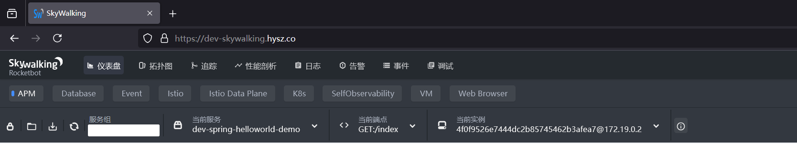
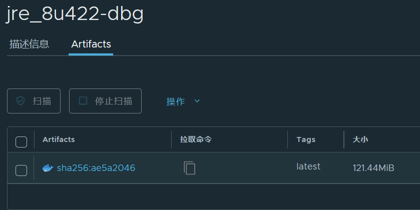

# 发行日志

**jre_8u422-dbg**, 一个基于eclipse-temurin官方镜像的 java docker 环境实现

## 构建原因

dev-harbor.hysz.co/basics/alpine_jdk8u301:v1 **278.95MiB** 构建于**2022/9/22**

dev-harbor.hysz.co/basics/centos7.9_jdk8u301:v1 **555.97MiB**  构建于**2022/11/1**

dev-harbor.hysz.co/basics/centos7.9_jdk8u301:v2 **681.36MiB**  构建于**2023/12/8**

现有的用于开发和测试的镜像存在:

1. 基础镜像版本陈旧, 缺乏安全和质量更新( alpine 和 CentOS )和可用软件源 (CentOS 7 已经停止维护)

2. JAVA 版本( jdk8u301 )陈旧, 缺乏安全和质量更新

3. 镜像体积庞大, 但是缺乏常用的调试工具, 调试工具难以通过软件源安装, 在无网络条件下非常难以排查问题

现有的许多项目需要直接通过容器提供Java Web服务, 为了减少安全隐患同时也为了便于调试, 针对现有的使用场景定制了 **jre_8u422-dbg** 基础镜像

## 构建特点

### 1.高性能且提供长期支持的 Java 虚拟机

Java虚拟机使用了Eclipse Temurin, 是一个由 Eclipse 基金会支持的高性能、可扩展的 Java 虚拟机( JVM )实现

* 拥有改进的即时编译器 JIT 和垃圾收集器 GC , 提供高性能的 Java 执行环境

* Eclipse Temurin 提供长期支持版本, 适合需要长期稳定运行的企业应用

* 定期发布安全更新, 帮助保护企业应用免受安全威胁

* 与 Java SE 标准保持高度兼容

### 2.兼容本地Dev环境和Ali-Prod环境的skywalking性能分析工具

支持通过启动命令快速切换不同环境的skywalking环境, 便于开发追踪 spring 程序的性能瓶颈

### 3.大量的调试工具可用

* curl wget 下载和HTTP测试工具

* netcat 多协议支持的网络通信、文件传输、端口扫描、远程控制、加密通信以及远程管理工具

* tcpdump 网络数据包分析工具

* tar unzip 解压工具

* btop 现代化的系统监控工具

* vim 文件编辑器

如果还需要其他工具, 基础镜像 Ubuntu 2204 LTS 提供海量的APT软件源

### 4.自定义的DevOps脚本支持

scripts文件夹中归档了目前内部常用的自动化运维脚本

### 5.轻量化

构建完成的基础镜像容量大小仅为**121.44Mib**

相比于现有的alpine_jdk8u301:v1 体积为**43.53%**

相比于现有的centos7.9_jdk8u301 体积为**21.84%**和**17.82%**

