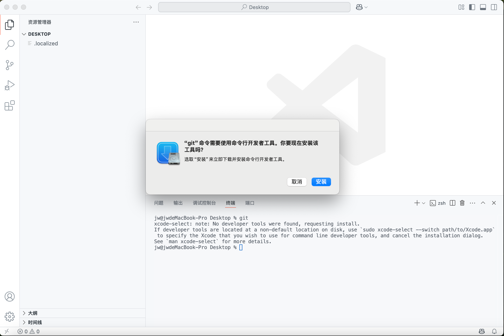
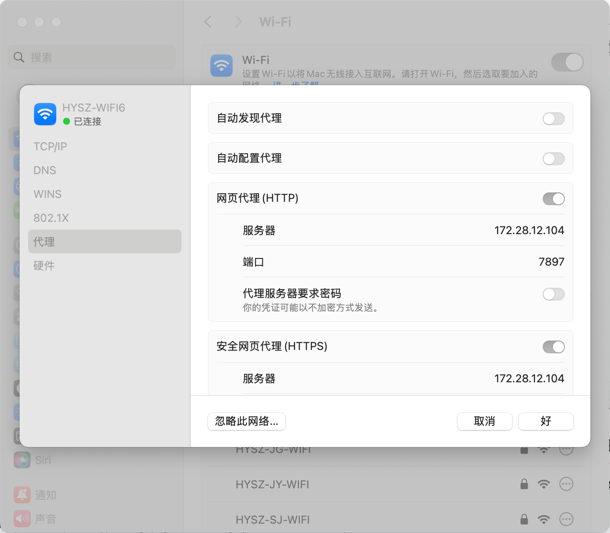
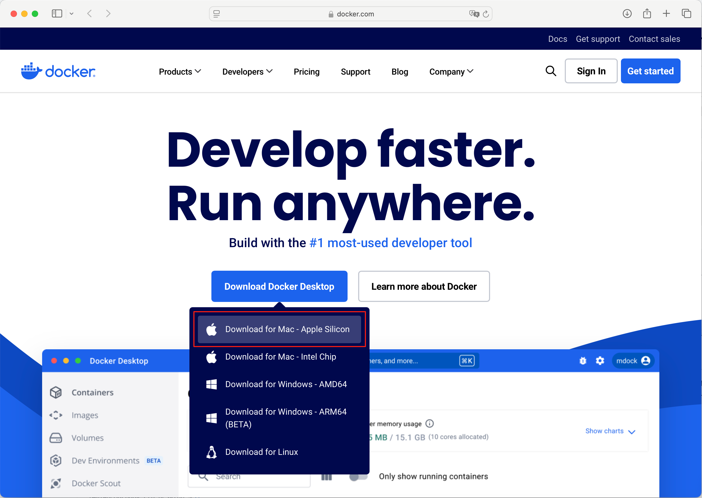
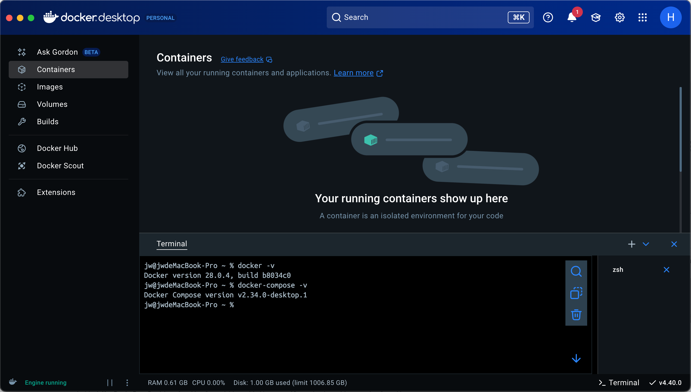
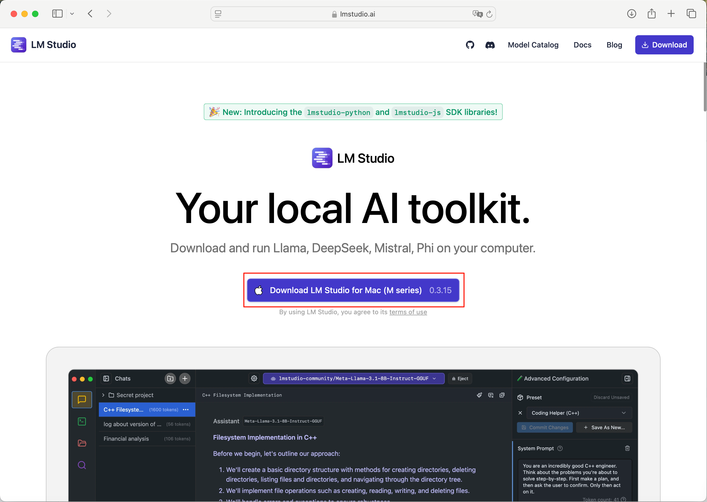
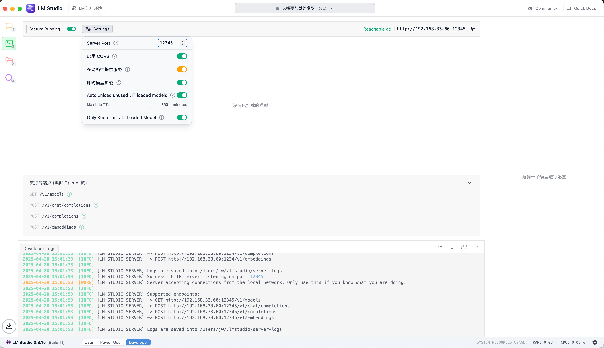

# 在MacBook上部署和运行基于离线LLM和Dify的个人知识库

## 安装git工具

按下`command键`+`空格`键，输入`teminal`呼出终端，在终端中输入`git`命令启用并下载开发者工具


## 为网络配置代理

在局域网内机器上部署了代理加速服务，将此台电脑的流量转发到局域网机器中



## 安装Docker和docker-compose

[下载](https://www.docker.com)适用于`Apple Silicon`的`Docker Desktop`



安装完成后使用默认设置初始化配置Docker桌面APP

受限于现有Docker相关政策，**需要登录Docker账号**才能高速下载`docker hub`的镜像，使用`foo@focus-in.cn`邮箱登录

配置Docker APP的开机自启动



## 拉取最新的Dify源码并启动容器服务

```Bash
mkdir -p ~/App
cd ~/App && pwd
# /Users/jw/App

# 拉取最新的Dify源码，此时版本为1.3.0
git clone https://github.com/langgenius/dify.git

cd /Users/jw/App/dify/docker
mv .env.example .env
docker-compode pull
# 如果遇到速度异常，检查代理配置或者docker login配置
docker-compose up -d
# Dify服务默认监听80端口，直接访问127.0.0.1即可到达Dify服务
```

## 安装和下载LLM运行时LM Studio

[下载](https://lmstudio.ai)并安装最新版本的`LM Studio`



开启LMS的开机自启动、关闭系统过载保护、开启`llama.cpp`运行时自动更新



配置LMS的API接口配置，允许在局域网中提供服务，监听端口`12345`，允许LLM的即时加载

如果不在局域网中提供服务，本地LLM API地址为`127.0.0.1:12345/v1`。这样会引入一个新的问题，Docker 部署的 Dify 使用桥接模式启动了一个子网，子网访问不到宿主机的本地回环网络，需要在 Docker Desktop 里面开启允许访问宿主机，配置使用 `host.docker.internal` 这个特殊的地址。

### LLM的选择

拉取LLM，推理模型选择了通义千问的`QWQ-32B-Q8`、Google的`Gemma-3-27B-QAT`、以及最新发布的 Qwen 系列的 MoE 模型

非推理模型选择了清华智谱的`GLM-4-32B-0414-Q8`

### Embdding模型的选择

text-embedding-nomic-embed-text-v1.5@f32
text-embedding-snowflake-arctic-embed-m-v1.5
text-embedding-mxbai-embed-large-v1
